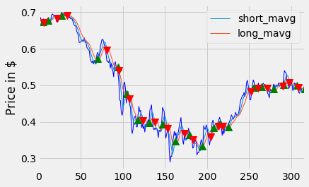

# Modeling Real-Time Currency Value Fluctuations with Cross-Border Digital Payment Flows

### Project Overview

This project focuses on modeling real-time currency value fluctuations by leveraging cross-border payment flow data. It highlights the importance of accurate forecasting in mitigating risks and optimizing strategies for financial institutions.

### Key Objectives

1. Develop Machine Learning Frameworks: Real-time currency fluctuation modeling.

2. Integrate Diverse Data Sources: Combine cross-border payment data with Forex indices for analysis.

3. Leverage Hybrid Neural Networks: Employ autoencoders and wavelet transformations.

4. Optimize Performance: Use advanced optimization techniques for hyperparameter tuning.

5. Provide Actionable Insights: Assist stakeholders in making informed financial decisions.

### Models

1. ARIMA 
2. Kalman Filter
3. LSTM
4. Random Forest
5. DKRVFLN-AE
6. EMD-LSTM
7. ICA-LSTM-PSO

### Results

Accuracy Achieved: DKRVFLN-AE reached 92.7% accuracy, outperforming ARIMA (86.3%).

Error Reduction: RMSE reduced by 15% compared to baseline models.

Insights: Hybrid models capture non-linear dependencies effectively.
Enhanced predictive performance during stable market conditions.

### Trading Strategies

1. Double Cross - over: 

#### The Double Crossover Strategy is a trading technique used to identify potential buy or sell signals based on the interaction of two moving averages:

1. Short-Term Moving Average (Fast MA): Tracks recent price movements and responds quickly to changes.
2. Long-Term Moving Average (Slow MA): Smooths out price fluctuations over a longer period.
#### How it Works:
1. Buy Signal: When the short-term moving average crosses above the long-term moving average (indicating upward momentum).
2. Sell Signal: When the short-term moving average crosses below the long-term moving average (indicating downward momentum).

#### This strategy helps traders capitalize on trends while filtering out minor market noise.

2. Bollinger Band: 

#### The Bollinger Band Strategy is a technical analysis tool used to identify price volatility and potential trading opportunities based on price movements relative to a band structure:

1. Bands: Consist of a middle band (moving average) and two outer bands (standard deviations above and below the middle band).

#### Volatility Indicator:
 The bands widen during high volatility and narrow during low volatility.
#### How it Works:
1. Buy Signal: When the price touches or drops below the lower band (indicating a potential rebound).
2. Sell Signal: When the price touches or rises above the upper band (indicating potential overbought conditions).

#### This strategy helps traders identify overbought or oversold conditions and capitalize on price reversals.

## Feedback

If you have any feedback, please reach out to us at saailtayshete289@gmail.com 

